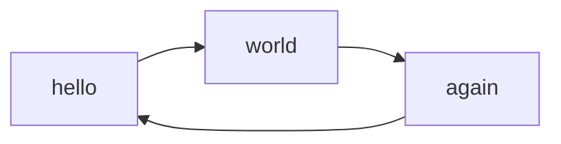
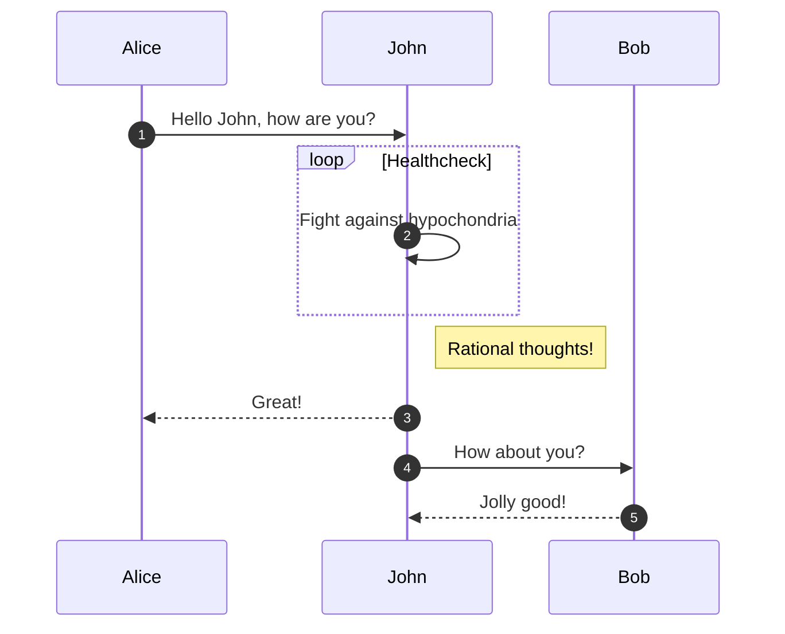
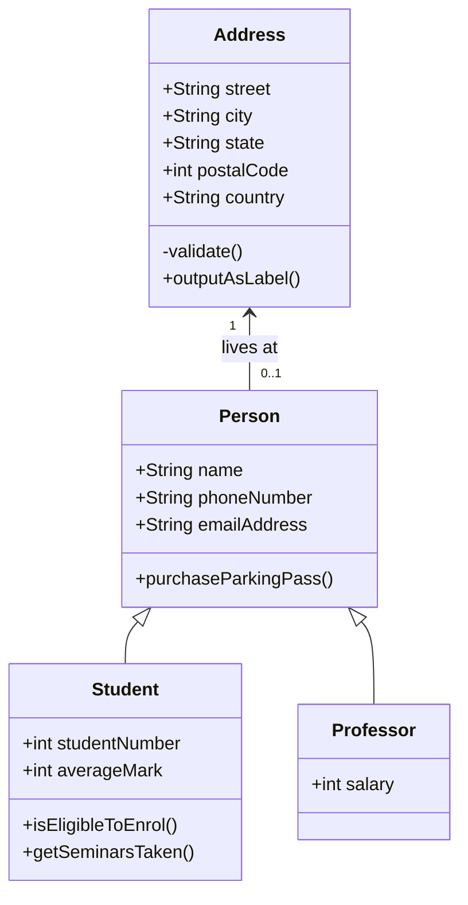

# Docs

## View the documentation locally:
Run: 
```sh
mkdocs serve
```
and go to `localhost:8000` to view the docs. Mkdocs hot-reloads the docs, so any changes you make will be immediately visible.


## Versioning 
We use `mike` to manage versioning for our documentation. It creates a snapshot of the documentation for each version of the project, allowing users to access the appropriate docs for the version they're using—even if it's an older one.

### Build new docs version 
Build the docs for the current project version: 
```sh 
mike deploy $(cz version --project) latest --update-aliases
```

To push your new docs version: 
```sh 
mike deploy $(cz version --project) latest --update-aliases --push
```

The first time you use Mike, you'll need to tell it which version is the default (the one it shows when you load the docs main page). We'll set it to the "default" alias:
```sh
mike set-default latest
```

To list the available docs versions: 
```sh
mike list 
```

To view the versioned docs locally (with a drop-down to select which docs version you want): 
```sh 
mike serve 
```


## Writing 
These are some tools you can use to enrich the documentation. 

### Diagrams 
Mermaid diagrams can be written in a `mermaid` code block, and they will be rendered as diagrams: 

Graphs: 


Sequence diagrams: 


Class diagrams:

### Tooltips 

Tooltips and other such "admonitions" can be written with a `!!!` block:
```
!!! note
    This is a note.
```

!!! note
    This is a note.

!!! tip
    This is a tip.

!!! warning
    Be careful!

!!! danger
    This is dangerous!

### Code blocks 
Specify python with the "py" shortcode after the 3 backticks.
You can highlight lines too with `hl_lines="3-5"`

```rust hl_lines="3-5"
/// Divides the first number by the second and returns the result.
///
/// # Panics
///
/// Panics if the second number is zero.
///
/// # Examples
///
/// ```
/// let result = rust_template::divide(6.0, 3.0);
/// assert_eq!(result, 2.0);
/// ```
pub fn divide(a: f64, b: f64) -> f64 {
    if b == 0.0 {
        panic!("Cannot divide by zero");
    }
    a / b
}
```

Inline code blocks can be highlighted for specific languages by prefixing `#!python`: `#!python lambda a: print(a)`

### Content tabs 
Content tabs can be used to show different versions of something in a tabbed layout:

=== "C"

    ``` c
    #include <stdio.h>

    int main(void) {
      printf("Hello world!\n");
      return 0;
    }
    ```

=== "C++"

    ``` c++
    #include <iostream>

    int main(void) {
      std::cout << "Hello world!" << std::endl;
      return 0;
    }
    ```

It doesn't have to be code: 
=== "Unordered list"

    - Sed sagittis eleifend rutrum
    - Donec vitae suscipit est
    - Nulla tempor lobortis orci

=== "Ordered list"

    1. Sed sagittis eleifend rutrum
    2. Donec vitae suscipit est
    3. Nulla tempor lobortis orci